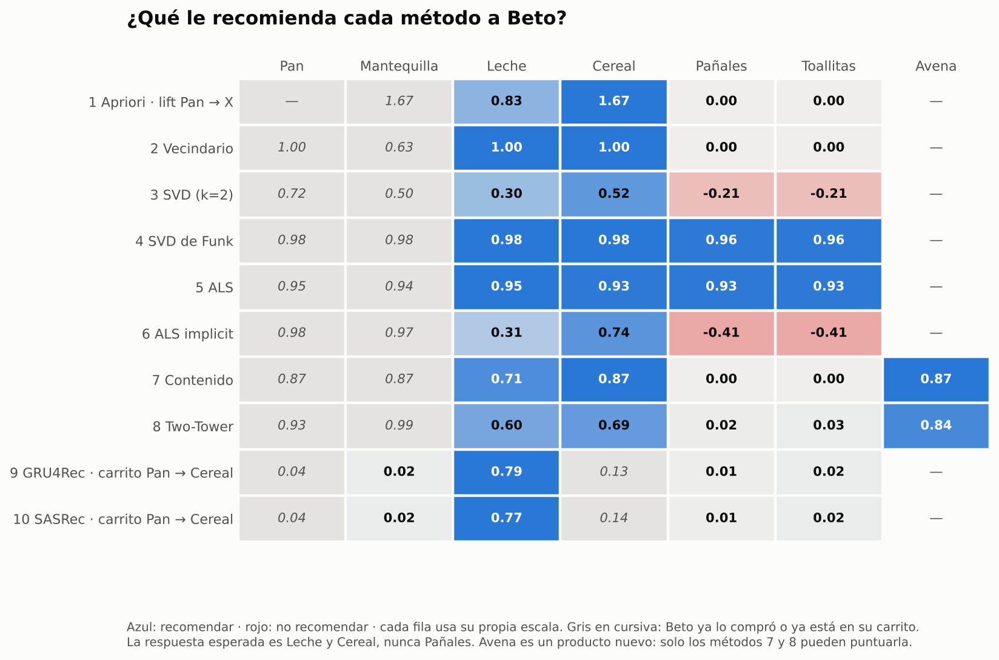
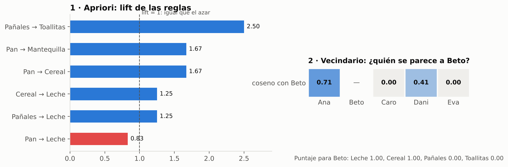
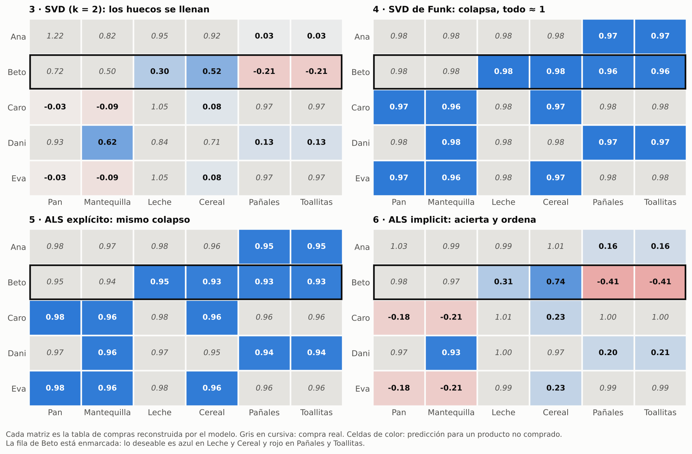
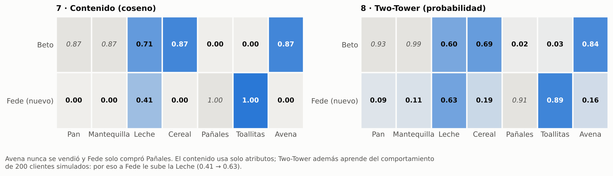
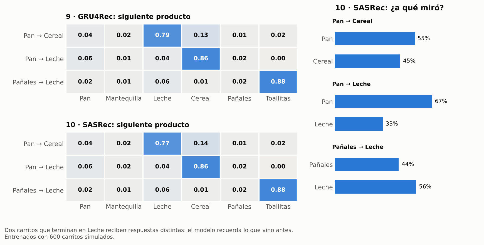

# Modelos de Recomendación: de Apriori a SASRec

Este repositorio tiene tres partes:

1. **Una revisión de 10 metodologías de recomendación**, ejecutadas todas sobre el mismo caso de supermercado. Muestra qué problema resuelve cada método, cómo supera al anterior y qué deja sin resolver.
2. **Un modelo real**: ALS implicit entrenado sobre el dataset público de Instacart (3,4 millones de órdenes), comparado contra popularidad y recompra, con ajuste de hiperparámetros en Optuna. Resultado: la recompra gana en la próxima canasta y ALS gana en descubrimiento (+22 % de NDCG@10 sobre popularidad).
3. **Un resumen técnico y de negocio** de cómo estos métodos se combinan en un motor de recomendación de supermercado.

> 🔎 **[Recorrido visual interactivo](https://robayomricardo95.github.io/ModelosRecomendacion/)** · **[Notebook de los 10 métodos](fundamentos/recorrido.ipynb)**

> Todos los números de este README salen de ejecutar el código del repositorio. Los del caso de juguete se reproducen con los comandos de la sección *Cómo reproducir*.

---

## 1. Resumen: qué resuelve cada metodología

| # | Metodología | Pregunta que responde | Cómo mejora al anterior | Limitación | Uso en negocio |
|---|---|---|---|---|---|
| 1 | **Apriori** | ¿Qué productos se venden juntos? | Punto de partida: reglas de asociación con soporte, confianza y lift | No personaliza: responde lo mismo a todos | Combos, góndolas, abastecimiento |
| 2 | **Vecindario** (filtrado colaborativo) | ¿Qué compraron clientes parecidos a ti? | Personaliza con el historial de cada cliente | Similitudes en 0 con datos escasos; costo crece al cuadrado | Catálogos pequeños, "clientes como tú" |
| 3 | **SVD** | ¿Qué patrones ocultos explican las compras? | Comprime en patrones latentes: nacen los embeddings; conecta clientes de forma indirecta | Trata lo no comprado como "no le gusta" | Análisis exploratorio de gustos |
| 4 | **SVD de Funk** | Igual, aprendiendo solo de lo observado | Ignora los huecos en lugar de castigarlos | Con compras (solo "sí") colapsa: predice 1 en todo | Ratings explícitos (estrellas) |
| 5 | **ALS** | Igual que Funk, resuelto por turnos | Regresión exacta por turnos: rápido y paralelizable (Spark) | Mismo objetivo que Funk, mismo colapso con compras | Escala a millones de usuarios |
| 6 | **ALS implicit** | ¿Qué le gusta a este cliente, según su frecuencia de compra? | Huecos como "no" débil y compras repetidas con más confianza | No conoce productos ni clientes nuevos (cold-start); ignora atributos y orden | **Base de "para ti" en supermercados** |
| 7 | **Basado en contenido** | ¿Qué productos se parecen a lo que compras? | Recomienda productos nuevos por sus atributos | Solo "más de lo mismo"; no aprende del comportamiento de otros | Lanzamientos, catálogo nuevo |
| 8 | **Two-Tower** | ¿Qué le gusta, usando comportamiento y atributos? | Une colaborativo y contenido; resuelve el cold-start; búsqueda rápida entre millones | Ve al cliente como una bolsa de compras: sin orden ni momento | Generación de candidatos a gran escala |
| 9 | **GRU4Rec** | ¿Qué agregará ahora al carrito? | Lee la sesión en orden; sirve sin conocer al cliente | Memoria que se diluye en sesiones largas; entrenamiento lento | "Te faltó…" en el carrito |
| 10 | **SASRec** | Igual, mirando directo a cualquier paso anterior | Atención: conecta pasos lejanos, entrena en paralelo, pesos inspeccionables | Necesita mucho dato; versión base solo usa IDs | Ranking en tiempo real de la sesión |

**Cómo trabajan juntos en producción.** Ningún método resuelve todo. Un motor de supermercado típico tiene dos etapas:

1. **Candidatos:** ALS implicit o Two-Tower eligen unos cientos de productos según *quién es* el cliente. El contenido o Two-Tower cubren productos y clientes nuevos.
2. **Ranking:** un modelo de sesión (GRU4Rec o SASRec) ordena esos candidatos según *lo que está haciendo ahora*.

Apriori se queda en el lado operativo (surtido y promociones), no en la personalización.

---

## 2. El caso de juguete: ¿qué le recomendamos a Beto?

Cinco clientes, seis productos. Ana, Beto y Dani compran desayuno; Caro y Eva compran productos de bebé. Beto solo ha comprado Pan y Mantequilla.

| Cliente | Pan | Mantequilla | Leche | Cereal | Pañales | Toallitas |
|---|---|---|---|---|---|---|
| Ana | 5 | 3 | 4 | 2 | – | – |
| **Beto** | 4 | 2 | **?** | **?** | **?** | **?** |
| Caro | – | – | 3 | – | 6 | 4 |
| Dani | 2 | – | 3 | 3 | – | – |
| Eva | – | – | 1 | – | 2 | 3 |

*(veces que compró cada producto en el mes)*

La respuesta que daría una persona: **Leche y Cereal, nunca Pañales.** Esto es lo que respondió cada método:



> 🔎 **Más detalle:** [recorrido visual paso a paso](https://robayomricardo95.github.io/ModelosRecomendacion/) (definiciones, fórmulas y cálculos) · [notebook con el código y las salidas de cada método](fundamentos/recorrido.ipynb)

### Métodos 1 y 2 · Contar y comparar

**1 · Apriori.** Cuenta qué productos aparecen juntos y arma reglas con soporte, confianza y lift.
- **Resultado:** Pan → Cereal tiene lift 1,67, así que a Beto le sugiere Cereal. Pan → Leche tiene lift 0,83 (menor que 1): el pan no "jala" leche en general.
- **Falla:** le daría la misma respuesta a cualquiera que lleve pan. Describe la tienda, no a la persona.

**2 · Vecindario.** Compara la canasta de Beto con la de cada cliente (similitud coseno) y promedia lo que compraron sus vecinos.
- **Resultado:** Ana (0,71) y Dani (0,41) son sus vecinos; Caro y Eva dan 0. Leche y Cereal empatan en 1,00 y Pañales queda en 0.
- **Falla:** empata, y entre clientes sin compras en común la similitud es 0 aunque se conecten a través de un tercero. Con catálogos reales casi todo da 0, y comparar todos contra todos crece al cuadrado.



### Métodos 3 a 6 · Comprimir en patrones (factorización matricial)

**3 · SVD.** Descompone la matriz en patrones ocultos y la reconstruye con los dos más fuertes (valores singulares 2,95 y 2,20; el resto suma poco).
- **Resultado:** Cereal 0,52 > Leche 0,30, y Pañales −0,21. Rompe el empate y la información de Ana y Dani llega a Beto a través del patrón "desayuno".
- **Falla:** trata todo lo no comprado como 0 = "no le gusta", y por eso empuja hacia abajo justo lo que queremos recomendar.

**4 · SVD de Funk.** Aprende los embeddings con descenso de gradiente, solo sobre las celdas conocidas.
- **Resultado:** todo ≈ 0,97, Pañales incluido (0,96).
- **Falla:** con compras solo existen "sí". Sin negativos, la salida más fácil es predecir 1 en todas partes.

**5 · ALS (explícito).** El mismo objetivo que Funk, resuelto por turnos con una regresión exacta.
- **Resultado:** todo entre 0,93 y 0,95. Mismo colapso.
- **Aprendizaje:** ALS cambia el *cómo* se calcula (rápido y paralelizable), no el *qué* se optimiza.

**6 · ALS implicit.** Usa todas las celdas con una confianza c = 1 + α·veces (α = 10): un hueco es un "no" débil y una compra repetida, un "sí" fuerte.
- **Resultado:** **Cereal 0,74 > Leche 0,31, Pañales −0,41.** Es el primer método que acierta y ordena. La pérdida baja de 60,6 a 12,3 en 15 vueltas.
- **Falla:** no puede puntuar productos ni clientes nuevos, y no usa atributos ni el orden de las compras.



### Métodos 7 y 8 · Lo nuevo: Avena (sin ventas) y Fede (una sola compra)

**7 · Basado en contenido.** El perfil de Beto es el promedio de los atributos de lo que compró; recomienda los productos más parecidos.
- **Resultado:** Cereal = Avena (0,87) > Leche 0,71. **La Avena entra sin una sola venta.** A Fede le sugiere Toallitas (1,00) y algo de Leche (0,41).
- **Falla:** solo "más de lo mismo". No distingue productos con las mismas etiquetas ni aprende del comportamiento de otros clientes.

**8 · Two-Tower.** Dos redes (cliente y producto) producen embeddings y P(compra) = σ(u·v). Se entrena con 200 clientes simulados.
- **Resultado:** a Beto, Avena 0,84 > Cereal 0,69 > Leche 0,60. A Fede, Toallitas 0,89 y Leche 0,63. La Leche de Fede sube de 0,41 a 0,63 porque el modelo aprendió de otros clientes que el grupo de bebé compra leche.
- **Falla:** ve al cliente como una bolsa de compras, sin orden ni momento. Le sigue sugiriendo Cereal aunque Beto ya lo tenga en el carrito.



### Métodos 9 y 10 · El carrito de ahora

**9 · GRU4Rec.** Lee el carrito en orden con una memoria (GRU) y predice el siguiente producto. Se entrena con 600 carritos simulados.
- **Resultado:** con el carrito Pan → Cereal, **Leche 0,79.** Dos carritos que terminan en Leche reciben respuestas distintas: después de Pan → Leche sugiere Cereal (0,86); después de Pañales → Leche, Toallitas (0,88).
- **Falla:** toda la sesión se comprime en un vector que se reescribe en cada paso; en carritos largos lo del principio se diluye.

**10 · SASRec.** Con atención, en cada paso mira directamente a todos los productos anteriores y los pondera.
- **Resultado:** Leche 0,77, con las mismas respuestas que GRU4Rec en los otros carritos. En Pan → Leche, el 67 % de la atención va al Pan. En Pañales → Leche la atención se reparte (44 % / 56 %) y aun así acierta Toallitas: **la atención es una pista de qué miró el modelo, no una explicación completa.**
- **Falla:** necesita mucho dato y la versión base solo usa IDs, así que tampoco resuelve lo nuevo.



### Notas honestas sobre el caso de juguete

- Los métodos 1 a 7 se ejecutan sobre los 5 clientes reales del ejemplo.
- Con 5 clientes una red neuronal solo memoriza. Por eso **Two-Tower se entrena con 200 clientes simulados** (120 de desayuno y 80 de bebé, con probabilidades de compra por segmento), y **GRU4Rec y SASRec con 600 carritos ordenados simulados** a partir de 7 plantillas, con un 30% de ruido.
- El objetivo de esta parte es mostrar el razonamiento entre métodos, no comparar su rendimiento. Para eso está la parte 3.


---

## 3. Caso real: ALS implicit sobre Instacart

**La pregunta de negocio.** Un supermercado en línea tiene dos carruseles: *"Compra de nuevo"* (lo que el cliente va a volver a comprar) y *"Descubre algo nuevo"* (lo que nunca ha comprado y podría interesarle). ¿Qué modelo sirve para cada uno?

**La respuesta corta.** Una regla simple de recompra le gana a ALS para predecir la próxima canasta. Pero cuando se mide solo el descubrimiento de productos nuevos, ALS supera a la popularidad en un **22 %** de NDCG@10. Por eso cada carrusel usa un modelo distinto.

| Carrusel | Modelo | Evidencia |
|---|---|---|
| "Compra de nuevo" | Recompra (los 10 productos que más compra cada cliente) | NDCG@10 de 0,384, el mejor en la próxima canasta |
| "Descubre algo nuevo" | ALS, filtrando lo ya comprado | +22 % de NDCG@10 sobre la popularidad en productos nuevos |

### Datos
- **Fuente:** Instacart Market Basket Analysis (Kaggle, espejo `psparks/instacart-market-basket-analysis`). Unos 3,4 millones de órdenes de unos 200.000 usuarios, con entre 4 y 100 órdenes cada uno.
- **Catálogo:** 21 departamentos → 134 pasillos → unos 50.000 productos.
- **Muestra de trabajo:** 20.000 usuarios (semilla 42).
- **Validación temporal:** se entrena con las órdenes 1 a n−2 de cada usuario, se valida con la orden n−1 y la orden n queda reservada como test final.
- **Limitaciones del dataset:** no hay fechas reales (solo número de orden), `days_since_prior_order` está topado en 30, y no hay precios ni demografía.
- Diccionario de datos completo en [`docs/diccionario_datos.md`](docs/diccionario_datos.md).

### Hallazgos de la EDA
- ⏳ **Pendiente:** historial por usuario: mediana de órdenes y % de usuarios con ≤ 5 órdenes (bloque 2.1).
- ⏳ **Pendiente:** tamaño de canasta: mediana y cuartiles de productos por orden (bloque 2.2).
- ⏳ **Pendiente:** tasa de recompra global y departamentos con más y menos recompra (bloque 2.3).
- ⏳ **Pendiente:** concentración de ventas: % de ventas del 1 % y del 10 % de productos más vendidos (bloque 2.4).
- ⏳ **Pendiente:** días más frecuentes entre órdenes y horas o días pico (bloques 2.5 y 2.6).
- ⏳ **Pendiente:** top 10 productos más vendidos (bloque 2.7).

### Tratamiento de datos
- **Filtro de cola larga** (productos con menos de 5 compradores): el catálogo baja un **46,4 %** (41.248 → 22.123 productos) y solo se pierde el **3,0 %** de las interacciones.
- **Densidad** de la matriz usuario × producto: **0,157 % → 0,284 %**.
- **Cobertura del test:** el **97,2 %** de lo comprado en la orden de validación existe en el catálogo de ALS. Es el techo del modelo.
- **Fuga de información:** 0 órdenes de validación dentro del entrenamiento.
- **Cold-start real:** 1 usuario quedó sin perfil (todo su historial era de cola larga) y recibe popularidad como respaldo.
- **Lo ya comprado no se filtra** en la tarea de próxima canasta, porque en supermercado la recompra es una parte central de la canasta.

### Resultados: predicción de la próxima canasta (validación, orden n−1)

| Modelo | Precision@10 | Recall@10 | NDCG@10 | Aciertos nuevos por usuario |
|---|---|---|---|---|
| Popularidad | 0,0698 | 0,0680 | 0,0953 | 0,129 |
| ALS inicial | 0,1081 | 0,1416 | 0,1564 | 0,123 |
| ALS ajustado (Optuna) | 0,2106 | 0,2648 | 0,2905 | 0,024 |
| **Recompra** | **0,2622** | **0,3201** | **0,3838** | 0,000 |

### Resultados: descubrimiento de productos nuevos (validación)

Las recomendaciones excluyen lo que el cliente ya compró y se evalúan solo contra los productos **nuevos** de su orden siguiente. El 83 % de los clientes (16.636 de 20.000) compró al menos un producto nuevo.

| Modelo | Precision@10 | Recall@10 | NDCG@10 |
|---|---|---|---|
| Popularidad "nueva para ti" | 0,0199 | 0,0386 | 0,0331 |
| **ALS descubrimiento** | **0,0240** | **0,0500** | **0,0403** |

### Ajuste de hiperparámetros (Optuna, 40 pruebas, sampler TPE)

| Objetivo | Mejores parámetros |
|---|---|
| NDCG@10 en la próxima canasta | BM25, α 1,02, 256 factores, reg 0,37, 10 iteraciones, K1 54,4, B 0,54 |
| NDCG@10 solo en productos nuevos | BM25, α 0,44, 32 factores, reg 0,002, 15 iteraciones, K1 68,9, B 0,33 |

Importancia de cada parámetro (objetivo próxima canasta): α 41 %, K1 28 %, B 18 %, iteraciones 9 %, método de ponderación 2 %, regularización 1 %, factores 1 %.

### Insights principales

1. **En supermercado, el hábito manda.** La regla de recompra es unas 4 veces mejor que la popularidad (NDCG 0,384 contra 0,095) y le gana a ALS ajustado. Cualquier modelo de "para ti" tiene que medirse contra ella, no solo contra la popularidad.
2. **Se obtiene lo que se optimiza.** Al optimizar NDCG, Optuna llevó a ALS a imitar la recompra: el NDCG subió un 86 %, pero los aciertos en productos nuevos cayeron un 80 % (0,123 → 0,024 por usuario).
3. **ALS inicial ganaba por recompra, no por descubrimiento.** Superaba a la popularidad en NDCG (+64 %) pero acertaba los mismos productos nuevos (0,123 contra 0,129). Su ventaja venía de ordenar mejor los productos habituales de cada cliente.
4. **Reformular el problema cambió la conclusión.** Al medir solo productos nuevos, ALS sí supera a la popularidad (+22 % de NDCG@10). De cada 1.000 clientes acierta unos 240 productos nuevos, frente a unos 199 de la popularidad.
5. **La forma de ponderar cada compra importa más que el tamaño del modelo.** α, K1 y B (la ponderación BM25) explican el 87 % de la variación; factores y regularización, el 2 %.
6. **El modelo ordena bien.** El 59,9 % de los clientes tiene al menos un acierto con ALS, contra el 43,9 % con popularidad. La tasa de acierto baja del 17,2 % en la posición 1 al 7,9 % en la posición 10.
7. **El tamaño de canasta cambia la lectura de las métricas.** La precision sube de 0,061 (canastas de 1 a 5 productos) a 0,182 (21 o más), y el recall baja de 0,221 a 0,070. Sin segmentar por tamaño de canasta, el promedio esconde dos comportamientos opuestos.
8. **Ejemplo de descubrimiento.** Un cliente que compra sobre todo soda, beef jerky, pistachos y queso en tiras recibió de ALS un yogur griego que nunca había comprado, y lo compró en su orden siguiente. ALS también le sugirió trail mix y nueces mixtas, del mismo gusto por snacks salados. Pero no le recomendó los pistachos ni el queso en tiras, que compra 9 y 8 veces: ALS suaviza los hábitos fuertes. Por eso necesita a la recompra al lado.

### Experimento adicional: mezclar listas a mano

En una primera corrida (sin filtro de cola larga y medida contra el test) se probó un **híbrido 7 + 3**: los 7 productos habituales del cliente más 3 productos nuevos de ALS.

| Modelo | Precision@10 | Recall@10 | NDCG@10 | Aciertos nuevos por usuario |
|---|---|---|---|---|
| Popularidad | 0,0716 | 0,0684 | 0,0965 | 0,129 |
| Recompra | 0,2664 | 0,3187 | 0,3865 | 0,000 |
| ALS | 0,1064 | 0,1364 | 0,1513 | 0,120 |
| Híbrido 7 + 3 | 0,2215 | 0,2742 | 0,3526 | 0,074 |

El híbrido cede unos 4,5 puntos de precision a cambio de descubrimiento. **Conclusión:** mezclar listas con una regla fija no es la forma correcta de combinar modelos. El siguiente paso es un ranker (por ejemplo LightGBM) que reciba los candidatos de todos los modelos y aprenda a ordenarlos.

### Pendientes del caso real
- ⏳ **Medición final en test (orden n)** de recompra, ALS y ALS descubrimiento, con los parámetros elegidos en validación.
- ⏳ Ranker que combine recompra y ALS con features de frecuencia, recencia, score de ALS y popularidad.
- ⏳ Llevar contenido, Two-Tower y SASRec al dataset real. Instacart trae `aisle` y `department` (atributos) y `add_to_cart_order` (orden dentro del carrito).

## Estructura

```
ModelosRecomendacion/
├── README.md
├── requirements.txt
├── docs/
│   └── index.html                ← recorrido visual (publicado con GitHub Pages)
├── fundamentos/                  ← caso de juguete (parte 2)
│   ├── generar_datos.py          ← crea la base con semillas fijas
│   ├── metodos.py                ← una función por método
│   ├── figuras.py                ← gráficos del README
│   ├── recorrido.ipynb           ← notebook con cada método y sus salidas
│   ├── construir_notebook.py     ← regenera y ejecuta el notebook
│   ├── datos/
│   │   ├── productos.csv         (7 productos × 5 atributos; Avena es nueva)
│   │   ├── compras.csv           (5 clientes del ejemplo)
│   │   ├── clientes_simulados.csv (200 clientes, para Two-Tower)
│   │   └── carritos_simulados.csv (600 carritos ordenados, para GRU4Rec y SASRec)
│   └── resultados/
│       ├── resultados.json       ← todos los números de la parte 2
│       └── figuras/              ← PNG usados en este README
└── aplicacion/
    └── als_instacart.ipynb       ← caso real (parte 3)
```

## Cómo reproducir

```bash
pip install -r requirements.txt
python fundamentos/generar_datos.py
python fundamentos/metodos.py      # ~20 s en CPU, sin GPU
python fundamentos/figuras.py      # gráficos del README
```

Las redes pequeñas (Two-Tower, GRU4Rec, SASRec) están escritas a mano con `autograd`, sin PyTorch, para que cada fórmula del recorrido se vea directamente en el código.

## Referencias

- Agrawal y Srikant (1994). *Fast Algorithms for Mining Association Rules.* — Apriori
- Funk (2006). *Netflix Update: Try This at Home.* — SVD de Funk
- Hu, Koren y Volinsky (2008). *Collaborative Filtering for Implicit Feedback Datasets.* — ALS implicit
- Covington, Adams y Sargin (2016). *Deep Neural Networks for YouTube Recommendations.* — Two-Tower
- Hidasi y otros (2016). *Session-based Recommendations with Recurrent Neural Networks.* — GRU4Rec
- Kang y McAuley (2018). *Self-Attentive Sequential Recommendation.* — SASRec
